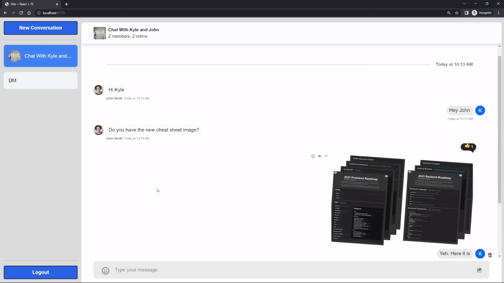
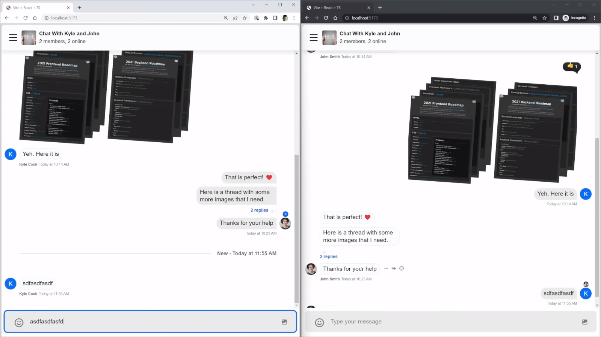

# Facebook Messenger Clone

Building cross-platform messaging experiences with [Stream Chat API](https://getstream.io).

Building a chat application is hard, especially if we want it to be a robust and full featured app similar to Facebook Messenger. Use Stream to build out an incredibly robust chat system with ease.

## Run Locally

### Server

Install dependencies

```bash
  npm install
```

Start the server

```bash
  npm run dev
```


### Client

Install dependencies

```bash
  npm install
```

Start the client

```bash
  npm run dev
```


## Environment Variables

### Server

To run this project, you will need to add the following environment variables to your .env file of server folder

`PORT=3001`

`CLIENT_URL=http://localhost:5174`

`STREAM_API_KEY`

`STREAM_PRIVATE_API_KEY`

### Client

To run this project, you will need to add the following environment variables to your .env file of client folder

`VITE_SERVER_URL=http://localhost:3001`

`VITE_STREAM_API_KEY`


## Screenshots





